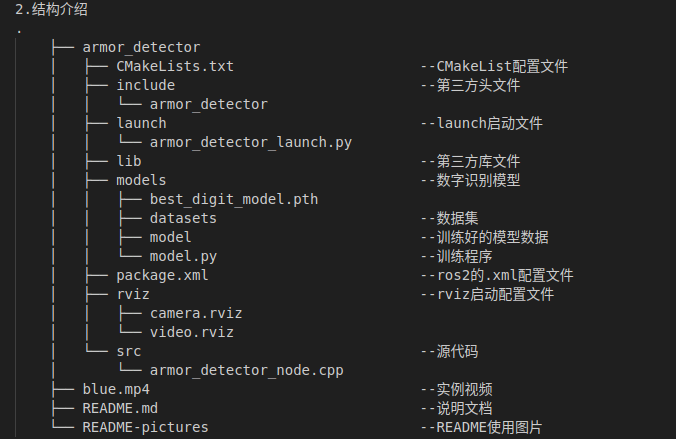
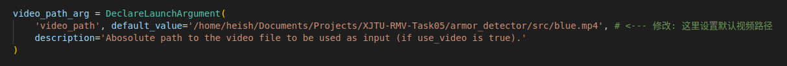
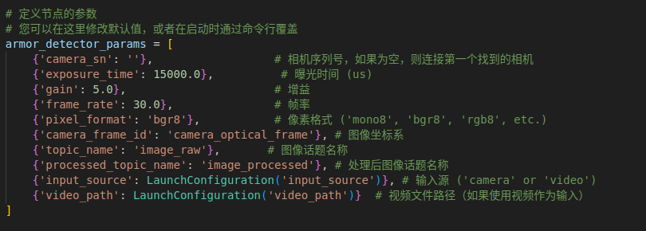
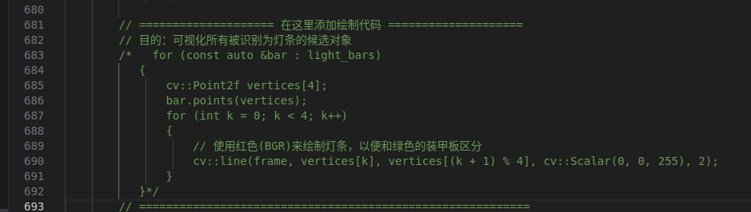
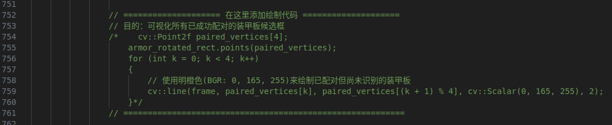
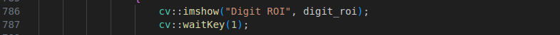
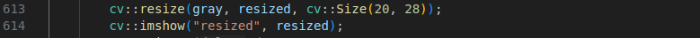
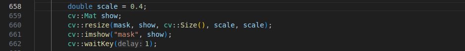

# XJTU-RMV-Task05---装甲板检测功能包
## 环境
Ubuntu-22.04  
OpenCV-4.12.0  
Ros2 Humble  
## 使用指南
1.将armor_detector完整移植到你的工作空间下  
   
3.launch文件配置和使用说明  
（1）若要使用blue.mp4或设置默认视频,请在video_path写入该视频的路径
  
（2）启动相机  
ros2 launch armor_detector armor_detector_launch.py input_source:=camera  
（3）启动视频（默认）  
ros2 launch armor_detector armor_detector_launch.py input_source:=video  
（4）启动视频（指定）  
ros2 launch armor_detector armor_detector_launch.py input_source:=video video_path:="你的视频路径"  
（5）可在这里修改默认参数  
  
4.源代码中可选显示（绿色框为处理最终结果）  
（1）函数process_armor_detection中可选择绘制灯条(红色)  
  
（2）函数process_armor_detection中可选择绘制未被模型识别但已配对的灯条矩形框（明橙色）(慎选，可能数字识别有影响)    
  
（3）函数process_armor_detection中可选择显示ROI截取区域  
  
(4)函数run_inference中可选择显示传入模型的区域（28*20像素二值化区域）  
  
（4）函数process_armor_detection中可选择显示二值化后的全局图像    
  
5.关于PnP坐标转换  
（1）相机标定使用的是9号相机，在视频或相机取流中对非该相机得出的坐标误差会很大（如blue.mp4）  
（2）使用MATLAB标定，照片用的比较少，不到10张，给出的平均重投影误差在1.6个像素，可能也不大好。由于对这方面的精度应该没太大要求，所以也没优化  
6.关于识别效果，绿框时不时会出现中断，以及相机会把3经常识别成5，系模型训练的问题（如果绘制配对但未识别数字的矩形框会发现还是比较稳定的）,以及ROI区域可能会取入部分灯条  

